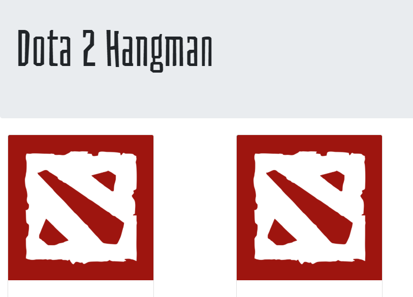

# hangman

HangMan Game

Purpose:
The purpose of this git project is to test user on their knowledge of dota 2 heroes by name. They game will pick a random name for the computer and obsure it with underscores. As the user guesses they will wrack up incorrected letters as well total letters guessed. When the letter is totally guessed, or the user runs out of chances, the game ends, a loss or win is tracked and game selects a new word. 
